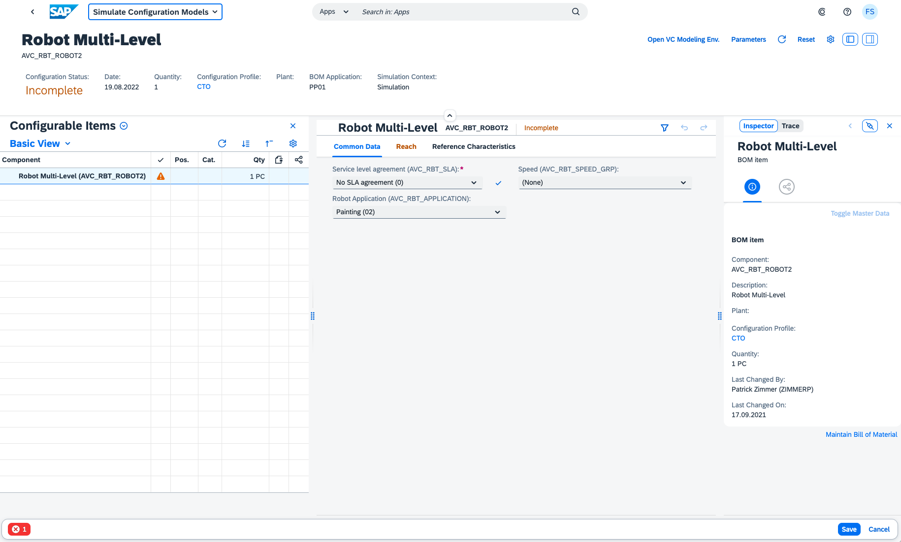
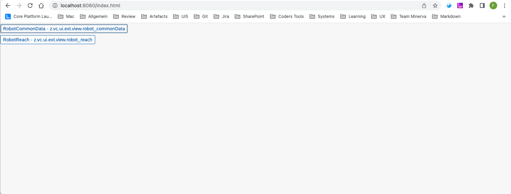
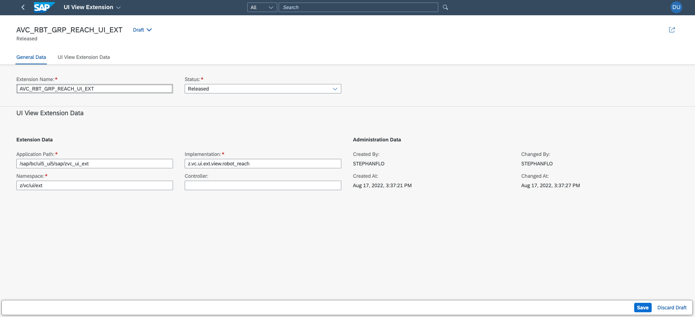
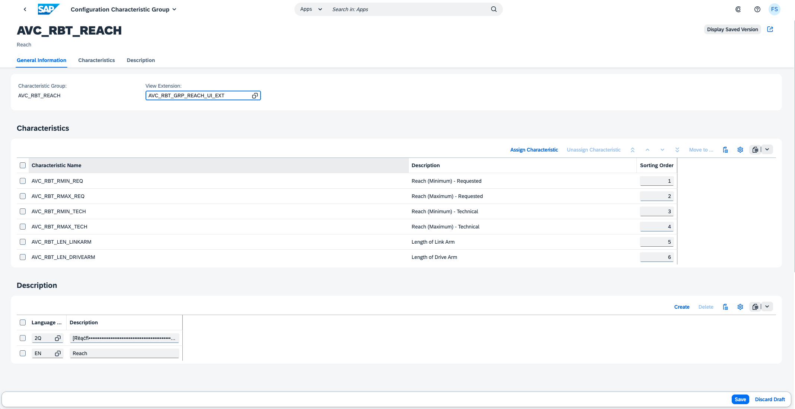

# Variant Configuration (VC) UI Extension Template Project

This repository contains code samples that illustrate how to write a VC UI Extension. It also includes a mock runtime to test VC UI Extensions locally without having the need to build and deploy an archive.

## Description

The Advanced Variant Configuration UI displays Characteristics in a responsive Grid. Initially 30 Characterics are shown. If more are available, a 'See more' button at the bottom is available to load the next chunk. The Product Configuration Modeler can make use of Characteristic Groups to distribute Characteristics over different tabs.

While this approach is sufficient for a lot of 'standard' use-cases, there are also other cases that need a more flexible UI that gives the modeler the freedom to arrange the Characteristics in a free manner dependent on the way how the configuration should be carried out to the internal end-users. This can mean that Characteristics are arranged arround a product image (they occur at the location where somehting needs to be configured) or that different sections within a group are created that the configuation follows a specific flow, even totally different layouts may be useful depending on the case.

With an UI Extension it is possible to replace the standard view for a Characteristic Group (the previously mentioned Grid to display the Characteristics) with an own implementation. An implementation basically leverages two custom controls of the Variant Configuration re-use Library to place Characteristics in freely defined Layout Containers. The Characteristics are addressed with their name. Furthermore it is also possible to use available UI5 Controls for own Characteristic representations.

## Requirements

This template project can be used to create VC UI Extensions that run with Advanced Variant Configruation on SAP S/4HANA 2302. For development this project requires a local installation of an active NodeJS LTS (Long Term Support) version and associated supported NPM version. See https://nodejs.org. Additionally the [UI5 CLI Tools](https://sap.github.io/ui5-tooling/pages/CLI/) must be installed globally <code>npm install --global @ui5/cli</code>.

## Contribution

If you wish to contribute code, offer fixes or improvements, please send a pull request. Due to legal reasons, contributors will be asked to accept a DCO when they create the first pull request to this project. This happens in an automated fashion during the submission process. SAP uses [the standard DCO text of the Linux Foundation](https://developercertificate.org/).

## Code of Conduct

Refer to [CODE OF CONDUCT](./CODE_OF_CONDUCT.md) file.

## Licensing

Copyright (c) 2022 SAP SE or an SAP affiliate company. All rights reserved. This project is licensed under the Apache Software License, version 2.0 except as noted otherwise in the [LICENSE](./LICENSE) file.

## Download and Installation

> ### Prerequisites
> As mentioned in the [Requirements](/README.md#requirements) section, the following must be installed:
> - Node JS Active LTS (v16)
> - [UI5 CLI Tools](https://sap.github.io/ui5-tooling/pages/CLI/) - Global installation happens with the following command: <code>npm install --global @ui5/cli</code>

The project is initialized by running the command <code>npm install</code> to resolve the given npm dependencies. It consists of two sample views ([<code>webapp/view/robot_reach.view.xml</code>](./webapp/view/robot_reach.view.xml) and [<code>webapp/view/robot_commonData.view.xml</code>](./webapp/view/robot_commonData.view.xml)) that illustrate how to use the **StandardCharacteristic** and **CustomCharacteristic**. The views make use of mockdata stored in the [<code>mockdata</code>](./webapp/mockdata/) folder and images that reside in the [<code>img</code>](./webapp/img/) folder. The mock runtime is started with command <code>ui5 serve</code>. Then in the Browser the page http://localhost:8080/index.html can be opened. It shows for each view (UI Extension), that is configured in the manifest, a button via which it can be launched. Event handlers are called and value assignments are written to the data model (in memory - not on disk), however any logic inmplemented in the origin Product Configuration Model can not be tested in the mock runtime mode. This can first be seen after the UI Extensions have been deployed and properly configured.

## Creating a new View

A new View can be copied from an existing sample view or created from scratch. In order to be able launch it from the initial Application page, it must be maintained in the routing targets section in the [<code>manifest.json</code>](./webapp/manifest.json) file. Note that the ui5 server has a livereload capability that whenever the sources change it autoamtically reloades the page.

## Mockdata

The mockdata file to use must be specified in the <code>targets</code> section in the [<code>manifest.json</code>](./webapp/manifest.json) file for each view separately (as it can be seen for the provided sample views). The data which needs to be provided to use the mock runtime mode is less then what is normally exchanged. See also the schema for the [<code>Characteristic</code>](./doc/odata_schema/Characteristic_schema.xml) and [<code>CharacteristicValue</code>](./doc/odata_schema/CharacteristicValue_schema.xml) entity. In case of bigger mock data amounts it is beneficial to obtain the data from the original <code>$batch</code> requests using the network tab in the browser developer tools when running the Simulation App.

## Implementation

See the [Implementation](./doc/IMPLEMENTATION.md) description for more details on how to use the **StandardCharacteristic** and **CustomCharacteristic** controls.

## Deployment

For deployment the project needs to be built using <code>ui5 build</code>. The result is then written to the <code>dist</code> folder in the project. 
> ### Attention
> - Be aware that you do not share the namespace over different UI extension projects. Running multiple UI Extensions from different deployment units with the same namespace at the same time (within one Product Configuration Model) is not possible.
> - The provided sample views refer to the product <code>AVC_RBT_ROBOT2</code> which is part of the 'SAP Best Practices for SAP S/4HANA Cloud' package. In order to make use of the product in the **Simulate Configuration Models** app, it must be activated.
> - The sources in the <code>libs</code> folder of the template project are necessary to provide the mock runtime for local usage - they are excluded from the build.
> - The <code>Component.js</code> file in the root of the project is also only used in local mock runtime mode - it must not be changed and is not relevant at "real" runtime (only the view which is specified within an UI Extension registration is injected into the valuation screen).

The necessary steps for deployment depends on the installation type:

### On Premise

In the On-Premise scenario, the <code>dist</code> folder can be directly uploaded to the Frontend System with the report <code>/UI5/UI5_REPOSITORY_LOAD</code>. The user needs to have developer permissions.

### Cloud

In the S4 Cloud scenario the deployment is only possible via BTP. Therefore the S4 Cloud system needs to be connected to BTP. With the Business Application Studio (BAS) it is then possible to upload to the S4 Cloud System. As setting up this deployment channel consists of several steps with a lot of details, you ideally look at the following tutorial: [Create a SAP Fiori App and Deploy it to SAP S/4HANA Cloud](https://developers.sap.com/group.abap-custom-ui-s4hana-cloud.html).

## Registering the UI Extension(s) 

An UI Extension is registered by creating an UI Extension Object for it in the **Maintain VC UI Extensions** app. Each UI Extension object has a logical name and can have multiple versions, but only one version can be set as active. The active version is the one which is in general shown whenever the AVC Configuration UI is embedded by other applications. For testing purposes, the Product Config Modeler can choose between the available versions of an UI Extension in the Simulation Environment.

## Attaching the UI Extension to a Characteristic Group

After the UI Extension Object has been saved, it can be attached to a Characteristic Group using the **Manage Characteristic Groups app**. The AVC Configuration UI displays now instead of the standard grid with Characteristics for a Characteristic Group the UI Extension. In case of problems while loading the UI Extension, an Error Page is shown.

## Limitations

The generic Event Handlers of the <code>sap.i2d.lo.lib.vchclf.api.valuation.controller.CustomCharacteristicGroupBase</code> controller can be applied to most of the UI5 Control events. However there may be situations in which none of the generic handlers can be applied properly. In these cases an own event handler implementation becomes necessary. This can be done in an own controller derived from the CustomCharacteristicGroupBase controller - see the samples.

## How to obtain support
[Create an issue](https://github.com/SAP-samples/s4hana-avc-ui-extension-template/issues) in this repository if you find a bug or have questions about the content.

## License
Copyright (c) 2023 SAP SE or an SAP affiliate company. All rights reserved. This project is licensed under the Apache Software License, version 2.0 except as noted otherwise in the [LICENSE](LICENSE) file.
