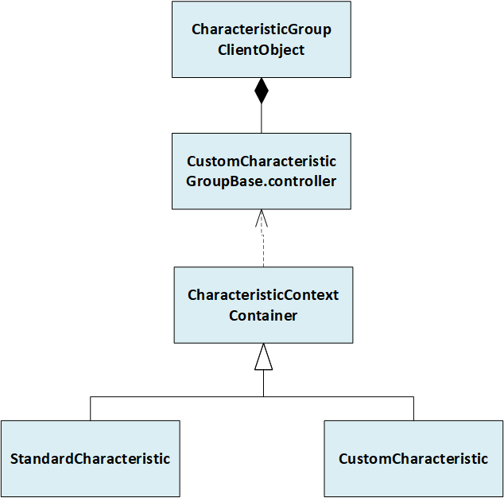
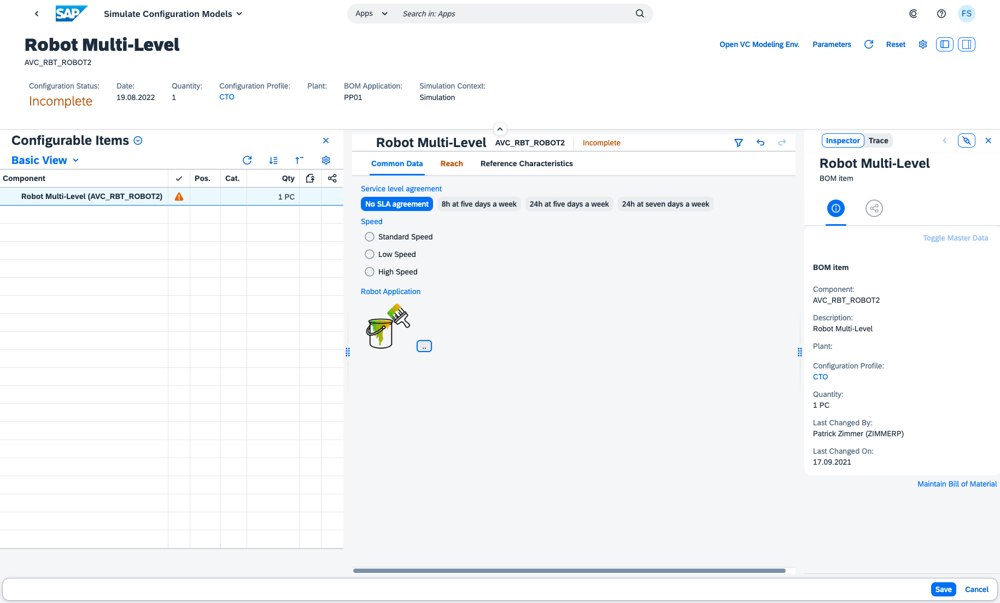

# UI Extension implementation

An UI Extension implementation starts with the creation a new UI5 XML View that refers to the <code>sap.i2d.lo.lib.vchclf.api.valuation.controller.CustomCharacteristicGroupBase</code> controller. In the next step Layout Containers are inserted and the [StandardCharacteristic](IMPLEMENTATION.md#the-standardcharacteristic-control) and [CustomCharacteristic](IMPLEMENTATION.md#the-customcharacteristic-control) control are placed and bound to the corresponding Characteristics.

> ### Attention - Namespace adoptions
> - When the namespace of the template is changed according to own name schemas, it needs to be considered that the namespace is represented with <code>.</code> and <code>/</code> notation as separation marker. This depends on the location of the specific defintion.

## Display and Edit scenario

The Valuation Panel is used in Display (read-only) and Edit mode. By default the runtime uses for a Characteristic Group with an UI Extension attached in the Display scenario the standard rendering (means the custom view is only used in Edit scenario). The main reason is, that in the display case no Domain Values are available. Nevertheless it is possible to provide a dedicated (read-only) Display variant of a custom view for a Characteristic Group. This works by following the below mentioned naming convention:

<code>\<custom-view-name\>_edit</code> - Edit Variant of custom view 
<code>\<custom-view-name\>_display</code> - Display Variant of custom view 

In the UI Extension for field <i>Implementation</i> the full qualified name of the Edit Variant must be maintained. 

## API Documentation

The JSDoc describing the API objects is found [here](./api/index.html).

## Inheritence and Composition of API Objects

## The StandardCharacteristic control

The <code>sap.i2d.lo.lib.vchclf.api.valuation.control.StandardCharacteristic</code> control allows to re-use the normal Characteristic representation (as in Characteristic Groups without UI Extension) but placing it in a custom layout structure (e.g. absolute Layout). A Characteristic is specified by its name. See the [Robot Reach View](../webapp/view/robot_reach.view.xml) sample.

## The CustomCharacteristic control

The <code>sap.i2d.lo.lib.vchclf.api.valuation.control.CustomCharacteristic</code> control is needed when the representation and behaviour of the <code>StandardCharacteristic</code> control which is limited to <code>sap.m.Input, sap.m.MultiInput and sap.m.Select</code> is not sufficient. It contains an aggregation <code>content</code> in which any UI5 control (typically a whole control tree representing the custom visualization of Characteristic) can be placed. The child controls automatically interhit the <code>view</code> BindingContext which is referring to the actual Characteristic entity in the OData Model specified by the <code>name</code> property. Available properties of the Characteristic entity (see the schema for the [<code>Characteristic</code>](./odata_schema/Characteristic_schema.xml) and [<code>CharacteristicValue</code>](./odata_schema/CharacteristicValue_schema.xml) entity) can now be used for bindings. In order to perform a value assignment, a suitable event on a child control must be mapped to one generic event handler of the <code>sap.i2d.lo.lib.vchclf.api.valuation.controller.CustomCharacteristicGroupBase</code> controller. The <code>view</code> BindingContext of the control triggering the event is either referring to the Characteristic entity or to a Characteristic Value entity (in case of value selection). The <code>by</code> suffix of each generic event handler indicates for which context it is applicable: <code>..ByCharcContext</code> vs. <code>..ByValueContext</code>. A generic event handler may require additional data which must be supplied using the <code>customData</code> aggregation of the control firing the event. The exact description of each available handler is found in the API reference. See also the [Robot Common Data View](../webapp/view/robot_commonData.view.xml) sample.

## Images

The <code>sap.m.Image</code> control can be used to include product pictures that should be displayed. There are two use-cases:

- A static image not bound to a dedicated Characteristic Value
- Images that represent the different Domain Values of a Characteristic which should be used for selection

In both cases the <code>src</code> property must be bound to an URL which is composed by the <code>formatter</code> that comes with the <code>sap.i2d.lo.lib.vchclf.api.valuation.controller.CustomCharacteristicGroupBase</code> controller. There are different functions:

- <code>getImageResourceUrl(sPath)</code>
- <code>getImageResourceUrlForValue(oValue, sSuffix)</code>

Note that the <code>parts</code> property in the binding object needs to be filled according to the function signature. More details are found in the API description. The images must be part of the project and need to be placed in a folder with name [<code>img</code>](../webapp/img/). In case of images for Characteristic Values, the following directory structure must be applied: <code>img/[CSTIC_NAME]/[TECHNICAL_VALUE]</code>

## The BindingContext 'view' outside of the CustomCharacteristic control

Within a custom Characteristics Group view, the BindingContext <code>view</code> offers access to the Characteristics inlcuding their assigned values. Each Characteristic can be accessed via the name e.g.: <code>view>Characteristics/AVC_RBT_RMIN_REQ</code>. Note that this access is for read-only purpose and does not support any interaction with the Characteristic. It can be used for an assignment summary as shown with the [Robot ReachSummary Dialog](../webapp/view/fragment/robotReachSummaryDialog.fragment.xml).

## Beyond generic event handling; writting own controllers

Own controllers can become necessary when a special event handling (e.g. a custom Value Help like ColorPicker) is required. Important is, that any controller must be derived from <code>sap.i2d.lo.lib.vchclf.api.valuation.controller.CustomCharacteristicGroupBase</code> controller. The <code>CustomCharacteristicGroupBase> </code> controller offers access to the <code>CharacteristicGroupClientObject</code> which allows to retrieve Characteristic data but also to do 'manual' value assignment with technical values. See <code>onValueHelpRequest</code> and <code>onValueHelpDialogClose</code> functions in the [<code>RobotCommonData.controller.js</code>](../webapp/controller/RobotCommonData.controller.js).